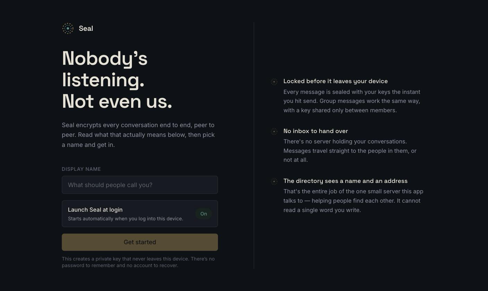
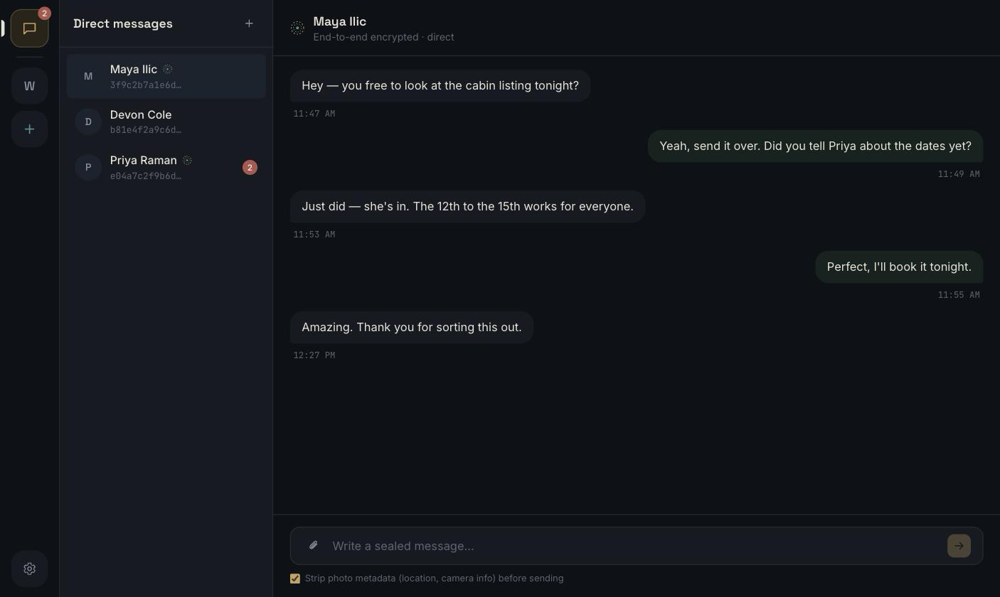
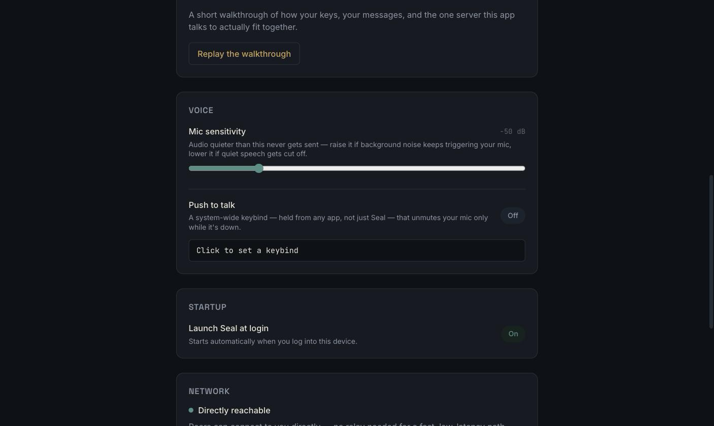

<div align="center">
  <a href="https://github.com/Emn4tor/Seal">
    
  </a>

  <h1>Seal</h1>

  <p><em>Peer-to-peer, end-to-end encrypted chat.<br />No inbox. No account to recover. Nobody's listening — not even us.</em></p>

  <p><a href="https://github.com/Emn4tor/Seal">github.com/Emn4tor/Seal</a></p>

  <p>
    
    
    
    
    
    
  </p>
  <p>
    <a href="https://github.com/Emn4tor/Seal/stargazers"></a>
    <a href="https://github.com/Emn4tor/Seal/network/members"></a>
    <a href="https://github.com/Emn4tor/Seal/issues"></a>
    <a href="https://github.com/Emn4tor/Seal/commits"></a>
    <a href="https://github.com/Emn4tor/Seal"></a>
  </p>
</div>

Messages travel directly between peers over libp2p and are encrypted with the
Signal-style Olm/Megolm protocols (via
[vodozemac](https://github.com/matrix-org/vodozemac)) before they ever leave
your device. The only server involved is a small directory that helps peers
find each other's current address. It never sees message content, and it's
purgeable in one command.

See [`docs/THREAT_MODEL.md`](docs/THREAT_MODEL.md) and
[`docs/SECURITY.md`](docs/SECURITY.md) for what's actually protected against
and how.

## Contents

- [Screenshots](#screenshots)
- [Features](#features)
- [How it works](#how-it-works)
- [Project layout](#project-layout)
- [1. Prerequisites](#1-prerequisites)
- [2. Building](#2-building)
- [3. Running it in dev mode](#3-running-it-in-dev-mode)
- [4. Testing](#4-testing)
- [5. Backend (directory server) setup](#5-backend-directory-server-setup)
- [6. Using the app](#6-using-the-app)

---

## Screenshots

<div align="center">

**First run** — pick a name; nothing else to set up.



<br /><br />

**Conversations** — the group rail, contact list, and an end-to-end encrypted chat pane.



<br /><br />

**Settings** — mic sensitivity, push-to-talk, launch-at-login, network reachability.



</div>

## Features

- **End-to-end encrypted, always** — every message is sealed with Olm (1:1)
  or Megolm (groups) before it ever leaves your device, using
  [vodozemac](https://github.com/matrix-org/vodozemac)'s Double-Ratchet-style
  scheme: every message gets its own key.
- **No inbox, ever** — messages travel over a direct peer-to-peer connection
  ([libp2p](https://libp2p.io): QUIC/TCP + Noise, with relay and
  hole-punching for NATs). If the recipient is offline, the message waits
  locally and retries — it's never queued on anyone else's infrastructure.
- **A directory, not a database** — the one server involved
  (`crates/directory-server`) maps a user ID to a current network address
  and nothing else. It's structurally incapable of reading message content:
  its `Cargo.toml` doesn't even depend on the crates that know how.
- **Multiple accounts, one device** — fully separate identities (keys,
  contacts, messages) that you can switch between without restarting.
- **Groups with real membership changes** — text and voice channels per
  group; removing someone rotates the group's key so they can't read
  anything sent afterward.
- **Voice, built in** — push-to-talk on a system-wide shortcut (works from
  any app, not just Seal), adjustable mic sensitivity, and an optional
  voice changer.
- **Attachments without the metadata** — EXIF data (GPS location,
  camera/device info) is stripped from images before they're sent, on by
  default.
- **A real panic button** — Settings → Data & Privacy instantly and
  irreversibly deletes every key, contact, and message on this device, with
  zero effect on anyone you've talked to.
- **Launch at login, if you want it** — on by default, a toggle away in
  Settings.
- **One codebase, three platforms** — native windows on macOS, Windows, and
  Linux, via [Tauri](https://tauri.app).

## How it works

There are two kinds of identity in this app, and they're deliberately kept
separate:

- **Your chat identity** is an Ed25519/Curve25519 keypair generated locally
  by [vodozemac](https://github.com/matrix-org/vodozemac) the first time you
  open the app (`identity::Identity`). Your public "user ID" is just the
  fingerprint of that key (`wire_proto::user_id_from_ed25519`). It can't be
  issued or revoked by any server, because no server is involved in creating
  it.
- **Your network identity** is a separate libp2p keypair (`PeerId`), used
  only for the transport layer. It can change across restarts without
  affecting your chat identity at all; the two are bound together only by a
  presence record you sign yourself.

Finding someone and actually talking to them are two different steps:

```
                     ┌────────────────────────┐
                     │     directory server    │
                     │  (axum + one SQLite     │
                     │   file: users,          │
                     │   presence, group       │
                     │   rosters. Never        │
                     │   message content.)     │
                     └─────────┬───────────────┘
             1. "where is bob  │  2. "here's my current
                 right now?"   │      address" (signed,
                                │      expires in minutes)
                     ┌─────────┴───────────────┐
                     ▼                         ▼
                 ┌───────┐   3. direct libp2p   ┌───────┐
                 │ alice │◄──── connection ────►│  bob  │
                 └───────┘   (Noise + Olm/      └───────┘
                              Megolm encrypted)
```

1. Alice looks Bob up on the directory by his user ID. This returns his
   public keys and his last-announced network address. That's the entirety
   of what the directory holds: public keys, display names, group
   membership lists, and short-lived address announcements
   (`crates/directory-server`).
2. Alice dials Bob directly over libp2p (QUIC or TCP+Noise, with relay +
   hole-punching for peers behind NATs; see `crates/net`). The directory is
   completely out of the picture from here on.
3. The actual message is encrypted with **Olm** for a 1:1 chat, or
   **Megolm** for a group (`crates/crypto-session`), a Double-Ratchet-style
   scheme where every message gets its own key, before it's ever placed on
   that libp2p connection. There is no server-side inbox: if Bob's offline,
   the message waits locally and is retried, not stored on anyone else's
   infrastructure.

Everything above is orchestrated by `crates/core`'s `AppService`, which is
what the Tauri app's Rust backend (`apps/desktop/src-tauri`) actually calls
into; the UI never talks to the network directly.

## Project layout

```
crates/
  wire-proto        shared signed-request types for the directory API
  identity          vodozemac identity, OS-keychain key management
  storage           local encrypted store (contacts, messages, groups)
  net               libp2p transport + directory HTTP client
  crypto-session    Olm (1:1) / Megolm (group) session management
  core              orchestrates the above into `AppService` / `ChatNode`
  directory-server  the one server component (axum + SQLite)
apps/desktop         the Tauri + React app
scripts/             build + backend-deployment scripts (§2, §5)
```

---

## 1. Prerequisites

You need **Rust** and **Node.js** on every platform, plus a platform-specific
toolchain Tauri needs to build a native window. `storage` and `directory-server`
also bundle-compile SQLite from source, which needs a plain C compiler (no
OpenSSL or other native crypto library required anywhere in this project).

Common to all platforms:

- [Rust](https://rustup.rs) (stable channel; install via `rustup`, not your OS package manager)
- [Node.js](https://nodejs.org) 20+ and npm

<details>
<summary><strong>macOS</strong></summary>

```sh
xcode-select --install
```

That's it. Xcode Command Line Tools provide both the C compiler and the
frameworks Tauri's macOS backend (WKWebView-based) needs.

</details>

<details>
<summary><strong>Linux</strong></summary>

Install a C compiler, `pkg-config`, and the WebKitGTK/AppIndicator dev
packages Tauri's Linux backend links against.

Debian/Ubuntu:

```sh
sudo apt update
sudo apt install libwebkit2gtk-4.1-dev build-essential curl wget file \
  libxdo-dev libssl-dev libayatana-appindicator3-dev librsvg2-dev pkg-config
```

Fedora:

```sh
sudo dnf install webkit2gtk4.1-devel openssl-devel curl wget file \
  libappindicator-gtk3-devel librsvg2-devel pkgconf-pkg-config
sudo dnf group install "C Development Tools and Libraries"
```

Arch:

```sh
sudo pacman -S --needed webkit2gtk-4.1 base-devel curl wget file openssl \
  appmenu-gtk-module libappindicator-gtk3 librsvg pkgconf
```

(Package names shift between Tauri releases: if a build fails looking for a
missing `.pc` file, check the
[current Tauri Linux prerequisites](https://v2.tauri.app/start/prerequisites/)
for your distro.)

</details>

<details>
<summary><strong>Windows</strong></summary>

1. Install the **Microsoft C++ Build Tools** (Visual Studio Installer →
   "Desktop development with C++" workload), needed both for Tauri's native
   shell and to compile bundled SQLite.
2. Install the **MSVC** Rust toolchain: `rustup default stable-msvc`.
3. **WebView2**: already present on Windows 11 and most up-to-date Windows
   10 installs; if not, Tauri's build will prompt you to install the
   Evergreen runtime.

</details>

---

## 2. Building

From the repo root:

```sh
# Rust workspace (backend crates + the directory server)
cargo build --workspace --release

# Frontend + the actual desktop app bundle (installer/.app/.exe)
cd apps/desktop
npm install
npm run tauri build
```

`npm run tauri build` produces a platform-native installer under
`target/release/bundle/` at the repo root (this is a Cargo workspace, so all
crates, including the Tauri app, share one top-level `target/` directory).
Cross-compiling (e.g. building the Windows installer from macOS) isn't set
up: build on each target platform, or use Tauri's GitHub Actions workflow
if you want CI-built releases.

### Or use the scripts

`scripts/` has one build script per platform/output, each independently
runnable and each verified to actually produce a working artifact:

| Script | Produces |
|---|---|
| `scripts/build-mac-dmg.sh` | macOS `.dmg` installer |
| `scripts/build-mac-app.sh` | Raw macOS `.app` bundle, no installer |
| `scripts/build-linux.sh` | Linux `.AppImage` + `.deb` |
| `scripts/build-windows.ps1` | Windows `.msi` + `.exe` (NSIS) |

Each just wraps `npm run tauri build --bundles <...>` with the right flags
and platform check; run the raw command yourself if you want a different
bundle combination (`npx tauri build --help` from `apps/desktop`).

### Baking in your own "Seal" network

The server-choice screen (§3) always shows three options: **Seal** (your
own official network), **Custom server**, and a small **Local test server**
link at the bottom. "Seal" is disabled (greyed out, with "Not set up in
this build yet") until you bake in a URL at *build* time:

```sh
SEAL_DEFAULT_DIRECTORY_URL=https://directory.example.com npm run tauri build
```

Once you've stood up your own server (§5) and have a real domain pointed at
it, set this and rebuild: every copy you distribute from then on shows
"Seal" as a real, selectable option using that URL, without touching any
other code. Leave it unset for ordinary/dev builds: there's no official
server hosted by this repo, so "Seal" stays disabled and people fall back to
a custom server or the local one, rather than the app silently pointing at
a placeholder domain that isn't actually running anything.

---

## 3. Running it in dev mode

```sh
cd apps/desktop
npm install
npm run tauri dev
```

This starts the Vite dev server, compiles the Rust backend in debug mode, and
opens a native window with hot-reload on the frontend. First build compiles
the whole dependency tree and takes a few minutes; subsequent runs are fast.

### Choosing a server (first run)

The first time you launch, Seal asks which directory server to use, in this
order:

- **Seal**: the official network, if this build has one baked in (see
  §2). Disabled until it is; this repo doesn't ship pointing at a
  placeholder domain.
- **Custom server**: anyone's, including your own (§5).
- **Local test server**: a small, deliberately de-emphasized link at the
  bottom. Spins up the app's own **embedded server** (binds
  `127.0.0.1:47100`/`47101`, data under your OS's app-data directory),
  fine for trying Seal out or testing instances on one machine, not a real
  deployment. If a second instance finds those ports already taken, it just
  reuses the first instance's server instead of starting another one,
  which is what lets two instances on one machine find each other. This is
  what gets picked automatically if "Seal" isn't configured and you don't
  choose anything else.

The choice is saved (`server.json` next to the app's other local data) and
reused silently on every later launch; change it from Settings → Directory
server, which takes effect the next time you start the app rather than
trying to hot-swap a running connection. For scripted/dev use, an
environment variable skips the prompt entirely:

```sh
P2P_CHAT_DIRECTORY_URL=https://directory.example.com npm run tauri dev
```

### Running two instances locally (to actually test messaging)

Each instance needs its own identity. Seal supports multiple accounts
natively (Settings → Accounts on this device), but for two *separate
processes* on one machine, `P2P_CHAT_PROFILE` is the quicker path: it
auto-creates (first time) or auto-resumes (every time after) an account
with that name, non-interactively, skipping the account picker entirely:

```sh
# terminal 1
P2P_CHAT_PROFILE=alice npm run tauri dev

# terminal 2
P2P_CHAT_PROFILE=bob npm run tauri dev
```

The server choice (`server.json`) and the account list (`accounts.json`)
are both shared across processes on one machine, not per-profile. The
first instance you ever launch picks the server, and every profile after
that (including `bob` here) reuses it silently. Both windows end up on the
same embedded directory server, so you can add each other as contacts by ID
and message between them.

Vite's dev server needs a real, fixed port for Tauri's webview to point at,
which normally means only one `npm run tauri dev` can run at a time — the
second one would find port 1420 already taken and fail outright.
`npm run tauri` is actually a small wrapper (`apps/desktop/scripts/tauri.mjs`)
that picks the next free port (1421, 1422, …) for every instance after the
first and wires it through automatically, so running the two commands above
in two terminals just works; you don't need to do anything differently. It
only changes behavior for `dev` — `npm run tauri build` and everything else
pass straight through to the real CLI.

### Testing against a real build (not dev mode)

```sh
./scripts/run-two-mac-instances.sh          # profiles: alice, bob
./scripts/run-two-mac-instances.sh carol dave
```

Same idea as above, but launches the actual built app (`build-mac-app.sh` /
`build-mac-dmg.sh`'s output, or an installed copy in `/Applications`) twice
with different `P2P_CHAT_PROFILE`s instead of `npm run tauri dev`, closer
to what a real user runs. Prints the PIDs and how to stop both.

### Debugging

- **Rust logs**: set `RUST_LOG` before launching, e.g.
  `RUST_LOG=debug npm run tauri dev` (or `RUST_LOG=p2p_core=debug,net=debug`
  to scope it down). Logged fields are limited to metadata (peer/group/user
  IDs, error types); see [`docs/SECURITY.md`](docs/SECURITY.md) for why
  that's safe to leave verbose.
- **Frontend**: the dev window is a real webview; right-click → Inspect
  Element (or open dev tools) works like a normal browser.
- **Backend crates in isolation**: each crate has its own test suite you can
  run and iterate on without touching the UI at all; see §4.
- **A standalone directory server**, instead of the embedded one: see §5.

---

## 4. Testing

```sh
# everything
cargo test --workspace

# one crate, e.g. the full backend-to-backend flow a Tauri command would trigger
cargo test -p p2p-core --test app_service

# lint + format check (what CI runs)
cargo fmt --all -- --check
cargo clippy --workspace --all-targets -- -D warnings

# dependency vulnerability scan
cargo install cargo-audit --locked   # once
cargo audit

# frontend type-check + build
cd apps/desktop && npm run build
```

---

## 5. Backend (directory server) setup

Recap of what this actually is, since it's easy to over-imagine: one axum
process, one SQLite file, three kinds of record (public keys, short-lived
presence announcements, group rosters), all writes signed by the caller's own
identity key. It is never in the path of a message. See
[`docs/THREAT_MODEL.md`](docs/THREAT_MODEL.md) for why that's true
structurally, not just by policy: `directory-server`'s `Cargo.toml` doesn't
even depend on the crates that know how to read message content.

### Fastest path: the setup script

```sh
sudo ./scripts/setup-backend.sh
```

Interactive, Linux + systemd only (see the script's header for why). It
asks which distro family you're on (Debian/Ubuntu, Fedora/RHEL/Rocky/Alma,
Arch/Manjaro, or openSUSE, pre-filled with a guess from `/etc/os-release`,
so it's usually a one-keystroke confirm) and installs that distro's build
prerequisites with a dedicated function per family, offers to install Rust
via `rustup` if it's missing, builds the release binary, creates a dedicated
system user, generates an admin token, asks whether you want it to
configure a domain with automatic HTTPS via [Caddy](https://caddyserver.com)
(installing Caddy itself, per-distro, falling back to Caddy's official
static binary if a distro's package isn't available), or to just bind
loopback/plain-HTTP if you'd rather front it yourself, then writes and
enables the systemd service. Safe to re-run.
Everything below is what it's actually doing, if you'd rather do it by hand
or understand it before running it.

### macOS: a quick LAN test server

```sh
./scripts/run-mac-test-server.sh
```

Not for real hosting: for testing the app across two devices on the same
network (e.g. your Mac + another machine, or two people on the same Wi-Fi)
without setting up a domain, TLS, or systemd (which doesn't exist on macOS
anyway). It builds the release binary, generates an admin token (reused on
later runs), binds the public API to all interfaces, and prints the URL to
use: your Mac's actual LAN IP (via `ipconfig getifaddr`), not just
`127.0.0.1`, so other devices can reach it too. The admin port stays on
loopback only. Runs in the foreground; `Ctrl-C` stops it. Data lives under
`~/.seal-test-server`.

### Quick local run

```sh
DIRECTORY_DB_PATH=/var/lib/seal-directory/directory.sqlite3 \
DIRECTORY_PUBLIC_ADDR=0.0.0.0:8080 \
DIRECTORY_ADMIN_ADDR=127.0.0.1:8090 \
DIRECTORY_ADMIN_TOKEN=$(openssl rand -hex 32) \
cargo run --release -p directory-server --bin directory-server
```

| Variable | Required | Meaning |
|---|---|---|
| `DIRECTORY_DB_PATH` | no (default `directory.sqlite3`, cwd) | Where the single SQLite file lives. Parent directory must exist. |
| `DIRECTORY_PUBLIC_ADDR` | no (default `0.0.0.0:8080`) | The rendezvous API that apps talk to. Fine to expose publicly. |
| `DIRECTORY_ADMIN_ADDR` | no (default `127.0.0.1:8090`) | The purge endpoint. Keep this off the public internet; see below. |
| `DIRECTORY_ADMIN_TOKEN` | **yes** | Bearer token for the admin API. The process refuses to start without one. Generate with `openssl rand -hex 32` or similar; don't reuse it anywhere else. |

The process logs which addresses it bound on startup and warns loudly if
`DIRECTORY_ADMIN_ADDR` isn't loopback.

### Pointing the app at it

Three ways, in the order you'd normally reach for them:

1. **First-run screen**: pick "Custom server" and enter the URL. See §3.
2. **Settings → Directory server**: change it later; takes effect on next
   restart.
3. **`P2P_CHAT_DIRECTORY_URL`**, set before launching: skips asking
   entirely and overrides whatever was saved, useful for dev/scripted runs:
   ```sh
   P2P_CHAT_DIRECTORY_URL=https://directory.example.com npm run tauri dev
   ```

Everyone who wants to find each other needs to point at the *same*
directory instance; it's how they look each other up in the first place.

### Running it as a real service (systemd)

<details>
<summary>Show the systemd unit + notes</summary>

```ini
# /etc/systemd/system/seal-directory.service
[Unit]
Description=Seal directory server
After=network.target

[Service]
Type=simple
User=seal-directory
Group=seal-directory
Environment=DIRECTORY_DB_PATH=/var/lib/seal-directory/directory.sqlite3
Environment=DIRECTORY_PUBLIC_ADDR=127.0.0.1:8080
Environment=DIRECTORY_ADMIN_ADDR=127.0.0.1:8090
EnvironmentFile=/etc/seal-directory/admin-token.env   ; DIRECTORY_ADMIN_TOKEN=...
ExecStart=/usr/local/bin/directory-server
Restart=on-failure

# Sandboxing: this process needs almost nothing
ProtectSystem=strict
ProtectHome=true
PrivateTmp=true
NoNewPrivileges=true
ReadWritePaths=/var/lib/seal-directory

[Install]
WantedBy=multi-user.target
```

Notes:

- `DIRECTORY_PUBLIC_ADDR` is bound to **loopback** here on purpose; put a
  reverse proxy in front for TLS (below) rather than exposing axum directly
  to the internet.
- Create the `seal-directory` system user/group and
  `/var/lib/seal-directory` first (`useradd --system --no-create-home
  seal-directory && install -d -o seal-directory -g seal-directory
  /var/lib/seal-directory`), and copy the built `directory-server` binary
  (from `target/release/`) to `/usr/local/bin/`.
- Put the admin token in a root-only-readable `EnvironmentFile`, not directly
  in the unit file (unit files are often world-readable).

</details>

### TLS via a reverse proxy

<details>
<summary>Show the Caddy / nginx config</summary>

[Caddy](https://caddyserver.com) gets you automatic HTTPS with the least
config:

```
# /etc/caddy/Caddyfile
directory.example.com {
    reverse_proxy 127.0.0.1:8080
}
```

`caddy run` (or `systemctl enable --now caddy`) handles certificate
issuance/renewal on its own. If you'd rather use nginx, terminate TLS there
and `proxy_pass http://127.0.0.1:8080;`, since the app only needs plain HTTP
from the proxy's perspective.

Firewall-wise: only the public port needs to be reachable from outside
(`8080` in the examples above, fronted by 443 via the proxy). The admin port
should never be reachable from outside; reach it over SSH port-forwarding
(`ssh -L 8090:127.0.0.1:8090 your-server`) when you need to run a purge
remotely.

</details>

### Purging it

```sh
cargo run --release -p directory-server --bin directory-admin -- \
  --admin-url http://127.0.0.1:8090 --token "$DIRECTORY_ADMIN_TOKEN" purge
```

This deletes the SQLite file and recreates an empty schema: no `DELETE`
statements, no partial state. It's safe to run without warning anyone first:
every record in it is a cache of data each client already holds locally
(their own registration, presence, and any group rosters they're a member
of), so clients just re-populate it within moments of their next action.
There's deliberately no backup policy for this database; see
[`docs/SECURITY.md`](docs/SECURITY.md) for why keeping one would undermine
the whole point.

---

## 6. Using the app

1. **First launch, first question**: which directory server to use (§3).
   The default is whatever's baked into the build you're running (a local
   test server, unless whoever built it configured an official one); pick
   "Custom server" to point at one you or someone you trust hosts.
2. **Pick a display name.** This generates a private key pair on your
   device (nothing to remember, and nothing recoverable if lost: that's
   deliberate) and walks you through a short in-app explanation of how the
   encryption actually works. Replay it anytime from Settings. Every later
   launch skips straight back in with no prompt; this only happens once per
   account. Add more accounts (fully separate identities) from Settings →
   Accounts on this device, and switch between them without restarting.
3. **Add someone**: click **+** next to "Direct messages" and enter their
   ID (found in *their* Settings → My Identity). There's no directory to
   browse by design; you connect the same way you'd share a phone number.
4. **Message them**: pick their name from the list and type. The first
   message to someone establishes an encrypted session automatically.
5. **Start a group**: click **+** on the icon rail, name it, then invite
   people by ID the same way. Removing someone rotates the group's key so
   they can't read anything sent afterward.
6. **Delete everything**: Settings → Data & Privacy. This is instant,
   local-only, and irreversible: it destroys your keys, contacts, and
   history on *this device* and has no effect on anyone you've talked to.
